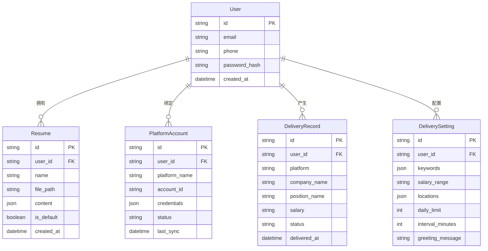

# 自动简历投递助手 - 技术架构文档

## 1. 架构设计

```mermaid
flowchart TB
    subgraph "前端层 Frontend"
        "UI组件"
        "状态管理"
        "路由控制"
    end

    subgraph "后端层 Backend"
        "用户服务"
        "简历服务"
        "平台适配器"
        "投递引擎"
        "任务调度器"
    end

    subgraph "数据层 Data"
        "用户数据库"
        "简历存储"
        "投递记录"
        "缓存层"
    end

    subgraph "外部服务 External"
        "BOSS直聘"
        "智联招聘"
        "前程无忧"
        "拉勾网"
    end

    "前端层 Frontend" <--> "后端层 Backend"
    "后端层 Backend" <--> "数据层 Data"
    "后端层 Backend" <--> "外部服务 External"
```

## 2. 技术选型

### 2.1 前端技术栈
- **框架**：React 18 + TypeScript
- **构建工具**：Vite
- **样式方案**：Tailwind CSS 3
- **状态管理**：Zustand
- **路由**：React Router v6
- **图表库**：Recharts
- **HTTP客户端**：Axios
- **UI组件库**：Headless UI（无样式组件）

### 2.2 后端技术栈（Demo阶段暂不实现）
- **运行时**：Node.js 18+
- **框架**：Express 4
- **数据库**：SQLite（轻量级，适合桌面应用）
- **ORM**：Prisma
- **任务调度**：node-cron
- **浏览器自动化**：Puppeteer（用于模拟登录和投递）

### 2.3 开发工具
- **代码规范**：ESLint + Prettier
- **类型检查**：TypeScript strict mode
- **包管理器**：pnpm

## 3. 路由定义

| 路由路径 | 页面名称 | 功能描述 |
|---------|---------|---------|
| `/` | 仪表盘 | 首页，数据概览和快捷操作 |
| `/resume` | 简历管理 | 简历列表和编辑 |
| `/platforms` | 平台管理 | 招聘平台账号绑定 |
| `/settings` | 投递设置 | 筛选条件和策略配置 |
| `/history` | 投递记录 | 历史记录和统计分析 |

## 4. 数据模型

### 4.1 实体关系图



### 4.2 数据定义语言（DDL）

```sql
-- 用户表
CREATE TABLE users (
    id TEXT PRIMARY KEY,
    email TEXT UNIQUE NOT NULL,
    phone TEXT UNIQUE,
    password_hash TEXT NOT NULL,
    created_at DATETIME DEFAULT CURRENT_TIMESTAMP
);

-- 简历表
CREATE TABLE resumes (
    id TEXT PRIMARY KEY,
    user_id TEXT NOT NULL,
    name TEXT NOT NULL,
    file_path TEXT,
    content JSON,
    is_default BOOLEAN DEFAULT 0,
    created_at DATETIME DEFAULT CURRENT_TIMESTAMP,
    FOREIGN KEY (user_id) REFERENCES users(id)
);

-- 平台账号表
CREATE TABLE platform_accounts (
    id TEXT PRIMARY KEY,
    user_id TEXT NOT NULL,
    platform_name TEXT NOT NULL,
    account_id TEXT,
    credentials JSON,
    status TEXT DEFAULT 'active',
    last_sync DATETIME,
    FOREIGN KEY (user_id) REFERENCES users(id)
);

-- 投递记录表
CREATE TABLE delivery_records (
    id TEXT PRIMARY KEY,
    user_id TEXT NOT NULL,
    platform TEXT NOT NULL,
    company_name TEXT NOT NULL,
    position_name TEXT NOT NULL,
    salary TEXT,
    status TEXT DEFAULT 'delivered',
    delivered_at DATETIME DEFAULT CURRENT_TIMESTAMP,
    FOREIGN KEY (user_id) REFERENCES users(id)
);

-- 投递设置表
CREATE TABLE delivery_settings (
    id TEXT PRIMARY KEY,
    user_id TEXT NOT NULL UNIQUE,
    keywords JSON,
    salary_range TEXT,
    locations JSON,
    daily_limit INTEGER DEFAULT 50,
    interval_minutes INTEGER DEFAULT 30,
    greeting_message TEXT,
    FOREIGN KEY (user_id) REFERENCES users(id)
);

-- 索引
CREATE INDEX idx_delivery_records_user ON delivery_records(user_id);
CREATE INDEX idx_delivery_records_status ON delivery_records(status);
CREATE INDEX idx_delivery_records_date ON delivery_records(delivered_at);
```

## 5. API接口定义（Demo阶段使用Mock数据）

### 5.1 用户相关
```typescript
// 获取当前用户信息
GET /api/user/profile
Response: {
  id: string;
  email: string;
  phone: string;
  createdAt: string;
}

// 更新用户信息
PUT /api/user/profile
Request: { email?: string; phone?: string; }
```

### 5.2 简历相关
```typescript
// 获取简历列表
GET /api/resumes
Response: Resume[]

// 创建/更新简历
POST /api/resumes
PUT /api/resumes/:id
Request: { name: string; content: ResumeContent; }

// 删除简历
DELETE /api/resumes/:id
```

### 5.3 平台管理
```typescript
// 获取平台列表及绑定状态
GET /api/platforms
Response: {
  name: string;
  logo: string;
  status: 'bound' | 'unbound';
  lastSync?: string;
}[]

// 绑定平台账号
POST /api/platforms/:name/bind
Request: { account: string; password: string; }
```

### 5.4 投递设置
```typescript
// 获取投递设置
GET /api/delivery/settings
Response: DeliverySetting

// 更新投递设置
PUT /api/delivery/settings
Request: DeliverySetting
```

### 5.5 投递记录
```typescript
// 获取投递记录
GET /api/delivery/records?page=1&size=20&status=delivered
Response: {
  total: number;
  page: number;
  size: number;
  records: DeliveryRecord[];
}

// 获取统计数据
GET /api/delivery/statistics
Response: {
  todayCount: number;
  totalCount: number;
  pendingCount: number;
  interviewCount: number;
  trendData: { date: string; count: number; }[];
  platformDistribution: { platform: string; count: number; }[];
}
```

## 6. 平台适配器架构

### 6.1 适配器接口
```typescript
interface PlatformAdapter {
  name: string;
  login(credentials: Credentials): Promise<boolean>;
  searchJobs(criteria: SearchCriteria): Promise<Job[]>;
  deliver(jobId: string, resumeId: string): Promise<DeliveryResult>;
  checkStatus(deliveryId: string): Promise<DeliveryStatus>;
  logout(): Promise<void>;
}
```

### 6.2 支持的平台
| 平台名称 | 登录方式 | API支持 | 实现方式 |
|---------|---------|---------|---------|
| BOSS直聘 | 扫码登录 | 无官方API | Puppeteer模拟 |
| 智联招聘 | 账号密码 | 无官方API | Puppeteer模拟 |
| 前程无忧 | 账号密码 | 无官方API | Puppeteer模拟 |
| 拉勾网 | 账号密码 | 无官方API | Puppeteer模拟 |

## 7. 项目目录结构

```
auto-resume-delivery/
├── src/
│   ├── components/          # 可复用组件
│   │   ├── common/          # 通用组件
│   │   ├── layout/          # 布局组件
│   │   └── features/        # 功能组件
│   ├── pages/               # 页面组件
│   ├── hooks/               # 自定义Hooks
│   ├── store/               # 状态管理
│   ├── services/            # API服务
│   ├── utils/               # 工具函数
│   ├── types/               # TypeScript类型定义
│   ├── mock/                # Mock数据
│   ├── App.tsx
│   └── main.tsx
├── public/
├── index.html
├── package.json
├── vite.config.ts
├── tailwind.config.js
└── tsconfig.json
```

## 8. Demo实现范围

本次Demo为前端展示版本，重点实现：
1. ✅ 完整的UI界面和交互
2. ✅ Mock数据模拟真实场景
3. ✅ 所有页面路由和导航
4. ✅ 数据可视化图表
5. ✅ 响应式布局
6. ⏸️ 后端API（使用Mock数据替代）
7. ⏸️ 真实的平台登录和投递功能